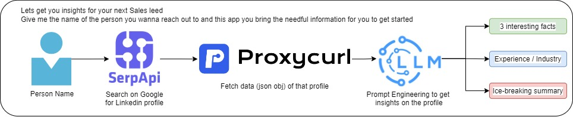

## Leverage Generative AI to Ice-break your next Sales Lead!
### Project Overview
<p align=center>

</p>
This project introduces an innovative **Ice-Breaker Application** designed to facilitate engaging and informed interactions for networking, sales, or socializing. The application operates through several key stages:

1. **Name Input**: Users input a name into the application.

2. **Search via SerpApi**: Utilizes SerpApi to conduct a search based on the provided name.

3. **LinkedIn Profile Extraction**: Identifies and extracts the LinkedIn profile URL from the search results.

4. **Data Retrieval via ProxyCurl**: Employs ProxyCurl to access detailed LinkedIn profile data.

5. **Prompt Engineering with LLMs**: The extracted data is processed by a Large Language Model (LLM), optimized through prompt engineering, to extract:
    - **Professional Experience and Industry Insights**: Offers insights into the individual's career path and industry.
    - **Interesting Facts**: Identifies unique or noteworthy aspects of the profile for conversation starters.
    - **Ice Breaker Summary**: Provides a concise summary combining professional and personal insights for meaningful interactions.

<p align=center>

</p>

### Application Purpose

The application aims to provide users with relevant, personalized information about individuals to facilitate smoother, more engaging conversations. Ideal for rapid rapport building in networking events, sales pitches, or social gatherings, it offers foundational knowledge about a person's professional background and interests.

### Demo

[](https://www.youtube.com/watch?v=5wcSSPoKjdw)


### Setup

- Fork this repo and create an **.env** file
```
SERPAPI_KEY=<your-key>
OPENAI_API_KEY=<your-key>
PROXYCURL_KEY=<your-key>
```
- Start the app using following command in your terminal
```
streamlit run app.py
```

### Future Work

The application currently on takes Linkedin data into account and it is planned to bring in more crediable sources of data to bring diverse insights of the profile.
## Leverage Generative AI to Ice-break your next Sales Leed!
### Project Overview
<p align=center>

</p>
This project introduces an innovative **Ice-Breaker Application** designed to facilitate engaging and informed interactions for networking, sales, or socializing. The application operates through several key stages:

1. **Name Input**: Users input a name into the application.

2. **Search via SerpApi**: Utilizes SerpApi to conduct a search based on the provided name.

3. **LinkedIn Profile Extraction**: Identifies and extracts the LinkedIn profile URL from the search results.

4. **Data Retrieval via ProxyCurl**: Employs ProxyCurl to access detailed LinkedIn profile data.

5. **Prompt Engineering with LLMs**: The extracted data is processed by a Large Language Model (LLM), optimized through prompt engineering, to extract:
    - **Professional Experience and Industry Insights**: Offers insights into the individual's career path and industry.
    - **Interesting Facts**: Identifies unique or noteworthy aspects of the profile for conversation starters.
    - **Ice Breaker Summary**: Provides a concise summary combining professional and personal insights for meaningful interactions.

<p align=center>

</p>

### Application Purpose

The application aims to provide users with relevant, personalized information about individuals to facilitate smoother, more engaging conversations. Ideal for rapid rapport building in networking events, sales pitches, or social gatherings, it offers foundational knowledge about a person's professional background and interests.

### Demo

<iframe width="640" height="360" src="https://www.youtube.com/embed/5wcSSPoKjdw" frameborder="0" allowfullscreen></iframe>


### Setup

- Fork this repo and create an **.env** file
```
SERPAPI_KEY=<your-key>
OPENAI_API_KEY=<your-key>
PROXYCURL_KEY=<your-key>
```
- Start the app using following command in your terminal
```
streamlit run app.py
```

### Future Work

The application currently on takes Linkedin data into accoun